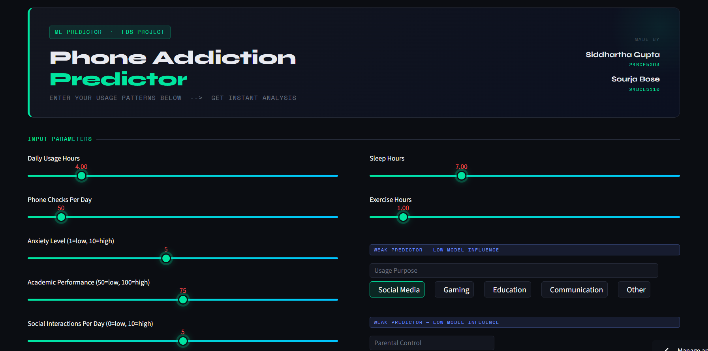
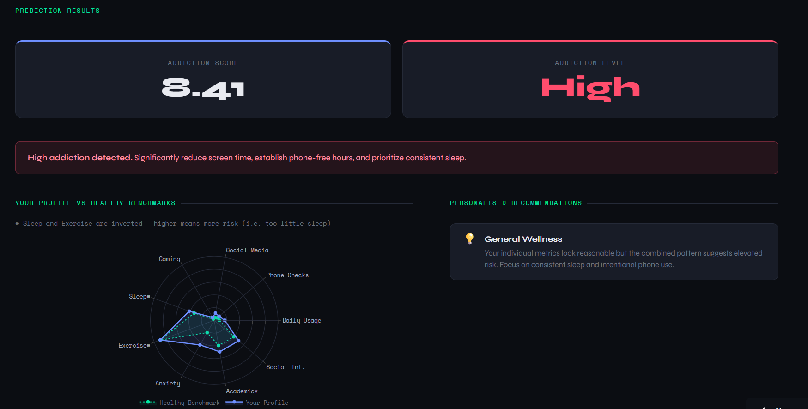
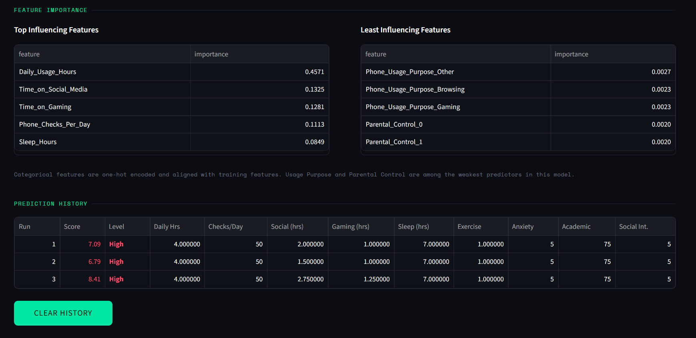

# 🤳Phone Addiction Level Prediction

This project predicts phone addiction levels using Machine Learning.

  

## 🪶Features
- Random Forest Model
- Feature Importance Analysis
- Streamlit Web Application
- Real-time Prediction

## ⚙️Tech Stack
- Python
- Scikit-learn
- Pandas
- Streamlit

## ❔How to Run
1. Train model:
   <code>python data_train.py</code>
  
3. Run app:
   <code>streamlit run app.py</code>

## 🪧Live Demo
https://phone-addiction-predictor-5xen22bxerb2wwubewgeqb.streamlit.app/

## 💯Model Performance
- <b>R² Score: 0.763</b> | (out of 0-1) Higher is better
- <b>MAE: 0.516</b> | (out of 0-10) Lower is better
  
## 📤Output & Screenshots
- Addiction Score (0–10)
- Addiction Level (Low/Medium/High)
- Visual Insights

  
  

## DISCLAIMER
The dataset used in this project is simulated and defines the relationship between features and addiction levels. 
Therefore, the model predictions are directly influenced by the dataset's assumptions.

For example, lower screen time values (e.g., 4 hours/day) may be classified as risky in the dataset, 
even though such usage might be considered normal in real-world scenarios today.

This highlights that the model reflects the dataset patterns rather than absolute real-world truth.

URL for the kaggle (teen_phone_addiction_dataset.csv) : https://www.kaggle.com/code/sumedh1507/predicting-phone-addiction-level/input

---
2026 - Siddhartha Gupta | Sourja Bose
